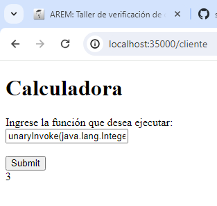

### Escuela Colombiana de Ingeniería

### Arquitecturas Empresariales

#### PARCIAL 1

#### Santiago Arévalo Rojas

### Instrucciones para ejecución
Para ejecturarlo se debe clonar el repositorio, y abrir en el IDE de preferencia:  

Luego de esto se debe abrir la clase HttpServerCalculadora que es la clase Backend, y la ejecutamos, esta clase se está corriendo por el puerto 45000:

Una vez la ejecutamos queda lista para escuchar, luego vamos a la clase HttpServer que es la clase fachada, en esta se tiene un objeto de tipo HttpConnectionExample que se encarga de la conexión con el backend, este servidor corre por el puerto 35000, así luce la clase:  
  
Con los dos servidores corriendo nos conectamos al servidor fachada por medio del browser a la URL [http://localhost:35000/cliente](http://localhost:35000/cliente) que es en donde se le puede hacer las peticones:  
  
Esto dentro en el espacio se le solicita al usuario que ingrese la función que desea llamar ya sea invoke, unaryInvoke o binaryInvoke, (la funcionalidad Class no se alcanzó a terminar), al darle click a submit se hace una petición GET, por ejemplo al API http://localhost:35000/consulta?comando=binaryInvoke(java.lang.Math, max, double, 4.5, double, -3.7) que es el servidor fachada, al recibir esta petición, el servidor fachada hace la petición real al servidor backend al API http://localhost:45000/compreflex?comando=binaryInvoke(java.lang.Math, max, double, 4.5, double, -3.7) por medio del objeto HttpConnectionExample y se obtendrá el resultado:  
  
Si se solicita otra función, se hace el mismo proceso y se oprime en el botón submit, en este caso se pide la función unaryInvoke(java.lang.Integer, valueOf, String, "3"):  

Finalmente con la función invoke(java.lang.System, getenv), se obtiene:  

Si el usuario quisiera ingresar a un recurso no disponible, el servidor le manda a una pantalla de error, como en este caso, tratando de acceder a http://localhost:35000/hola:  
